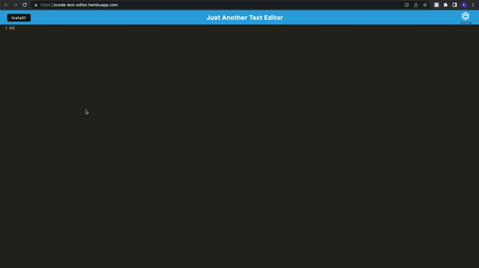

# zCode_text-editor

## Description

Progressive Web Application (PWA)

A text editor that runs in the browser. The application meets the Progressive Web Application (PWA), so can be installed locally and used offline.
It uses IndexedDB to save data on the client-side. Enjoy!

## Table of Contents

1. [Installation](#installation)
2. [Usage](#usage)
3. [Build](#build)
4. [Websites](#websites)
5. [License](#license)

## Installation

You can run this application locally by:

1. Install the required packages using `npm install`
2. Start the server by running `npm run start`
3. By default, the server will be listening on port 3000.
4. You can install the app locally for use offline by pressing the "install" button.

## Usage

1. Navigate to: https://zcode-text-editor.herokuapp.com/
2. Click the "install" button to install the app
3. Edit the text, your work will be saved automatically

### Demo

## Build

The following technology stack was used:

- Node.JS
- IndexedDB
- Webpack
- Workbox
- Babel
- Deployed to Heroku

## Websites

https://zcode-text-editor.herokuapp.com/

https://github.com/gmadnani/zCode_text-editor

## License

This project is licensed under MIT.